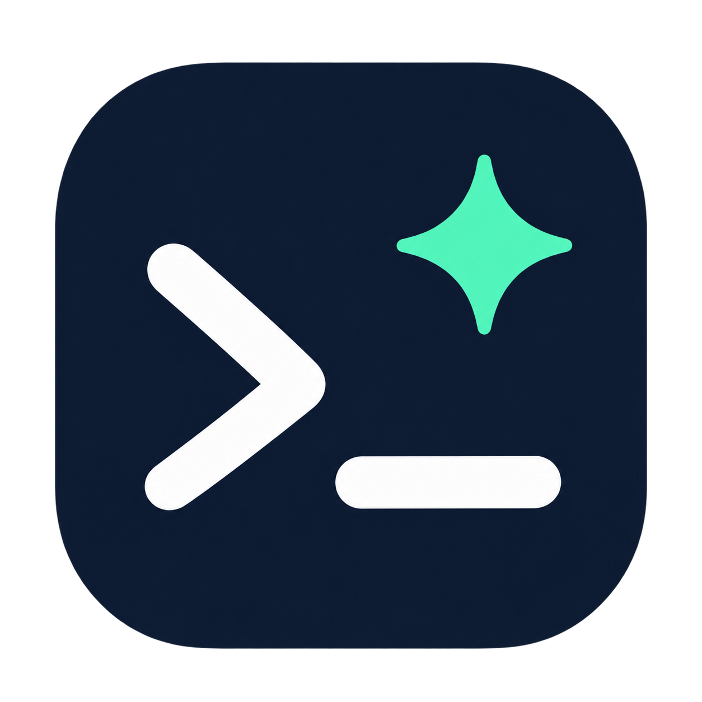

# TermGPT

原生 macOS 终端与 AI 聊天工作台。使用 SwiftUI、AppKit 和 SwiftTerm；终端独立运行，AI 可按需读取用户选择的终端上下文。

## 下载

从 [GitHub Releases](https://github.com/wangyeye/TermGPT/releases) 下载 macOS 13+ 安装包：

- Apple Silicon（M1/M2/M3 等）：`TermGPT-macOS-arm64.zip`
- Intel Mac：`TermGPT-macOS-x86_64.zip`

解压后将 `TermGPT.app` 拖入 Applications。提供 SHA256SUMS 校验文件。应用暂未 Developer ID 签名或公证；签名验证不等于 Gatekeeper 已批准。



## 功能

- 真实 PTY 本地终端，支持 ANSI、回滚、交互式 SSH 和 vim/top。
- 多终端标签、SSH 书签、私钥路径及 ProxyJump，使用系统 OpenSSH。
- 独立多聊天，支持流式回复、取消、历史保存与导出。
- ChatGPT 为首选；OpenAI API、Ollama、LM Studio 和兼容接口位于 Advanced / Other Providers。
- 上下文模式：Auto、Off、选中文本、最近 50/200 行、整个会话；支持固定上下文。
- 终端右键 Ask AI / Explain / Fix / Generate command。
- 代码块支持复制、填入和执行。低风险单行命令直接执行，未知或高风险命令需要点击“确认执行”，不需输入 RUN。
- 发送前自动脱敏可在设置中开启或关闭，发送时按设置后台处理，无确认弹窗。
- ChatGPT 令牌和 API Key 存储在 macOS Keychain。

## 环境检查与构建

需要 macOS 13+、Swift 5.9+、Xcode Command Line Tools、系统 SSH 和 zsh。测试需要完整 Xcode 的 XCTest；当前测试脚本定位标准 `/Applications/Xcode.app`。构建不需要 Rust、Node 或 npm，SwiftTerm 已随源码提供。

```bash
cd TermGPT
./scripts/check-environment.sh
./scripts/build.sh
./scripts/run.sh
```

输出为 `dist/TermGPT.app` 和 `dist/TermGPT-macOS-arm64.zip`。发行包分别提供 arm64 和 x86_64；Intel 包完成交叉编译和架构检查，尚未在实体 Intel Mac 实测。App 使用本地 ad-hoc 签名，没有 Developer ID 签名或公证。环境脚本会在缺少依赖时退出，不更改系统默认工具链或接受 Xcode 许可。

若工作目录由文件同步服务管理，建议解压 ZIP 到本机目录后使用；脚本在临时目录签名，避免文件同步元数据影响签名。

## 使用

1. 启动后直接使用本地 Shell。点击 SSH 书签旁的 `+` 添加主机，密码及主机指纹确认由系统 SSH 在终端中处理。
2. 打开设置，点击 Continue with ChatGPT，在系统浏览器完成登录和套餐授权。服务决定套餐、额度和模型权限；未返回套餐名时不会推测为 Plus。
3. 其他供应商在 Advanced / Other Providers 配置。OpenAI API 需要独立密钥；Ollama 默认 `http://127.0.0.1:11434/v1`，LM Studio 默认 `http://127.0.0.1:1234/v1`，本地服务需先启动并填写实际模型名。
4. 在聊天输入框按 Enter 发送、Option+Enter 换行。中文输入法确认候选时不会发送。
5. 用 Context 选择本次需要附带的内容。Auto 是启发式判断；明确控制发送范围时使用 Off 或手动模式。
6. 在 Terminal & Privacy 中设置“发送前自动脱敏”，保存后生效。默认开启；关闭后消息、历史和所选终端上下文会原样发送给当前供应商。
7. AI 不会自行执行命令。“填入”不发送 Enter；“执行”针对当前可见终端，发送前清除正常 Shell 输入行。不要在密码提示、vim 或其他交互程序中点击执行。

ChatGPT 的 Auto 选择服务器模型目录首个可见模型，不等同于 ChatGPT 网页自动路由。连接与推理使用官方 OAuth 和 Responses 接口；服务可用性及授权由官方服务控制。实现参考：[登录](https://developers.openai.com/siwc/token-sharing-open-source/sign-in)、[模型和推理](https://developers.openai.com/siwc/token-sharing-open-source/models-and-inference)、[会话管理](https://developers.openai.com/siwc/token-sharing-open-source/profiles-and-sessions)。

## 快捷键

| 快捷键 | 功能 |
| --- | --- |
| Cmd+T | 新建终端 |
| Cmd+W | 关闭终端并结束进程 |
| Cmd+Shift+N | 新建聊天 |
| Cmd+, | 设置 |
| Cmd+F | 终端历史搜索 |
| Enter / Cmd+Enter | 发送聊天 |
| Option+Enter | 换行 |
| Cmd+C / Cmd+V | 终端复制 / 粘贴 |

## 数据与隐私

- 项目源码不包含账户、密钥、真实聊天、SSH 配置或终端记录。
- ChatGPT 凭据保存在 Keychain service `local.TermGPT.chatgpt`；API Key 在 `local.TermGPT.api`。
- 设置、书签及可选聊天保存在 `~/Library/Application Support/TermGPT/workspace.json`，目录权限 0700、文件权限 0600。关闭保存聊天后，持久化文件不再包含聊天。
- OAuth 使用 PKCE、state、nonce 和签名验证；回调仅监听 127.0.0.1，有五分钟超时。Disconnect 清除本地令牌并尝试远程撤销。不会读取 ChatGPT 网站历史聊天。
- 终端回滚在内存中保存，最多 10,000 行；发送过的上下文可能随聊天保存。导出默认脱敏。
- 脱敏仅匹配常见格式，不保证识别所有秘密。关闭脱敏意味着所选供应商会接收到原文。
- 风险分类仅提供有限保护，不能证明命令安全或终端当前处于 Shell 提示符。

## 测试

```bash
./scripts/test-with-fixture.sh
./scripts/verify-package.sh
```

第一条检查 Python 3/curl 并启动仅监听本机的固定 SSE 模拟服务，运行测试后关闭服务；不使用真实密钥。测试覆盖 PTY、上下文、SSH 参数、脱敏设置、输入快捷键、OAuth 回调、PKCE、签名验证及配置迁移。第二条独立解压发行 ZIP，检查 plist、架构和签名。

自动测试不等于真实账户、真实模型、所有 macOS 版本或真实 SSH 主机都已验证。本地开发记录、测试输出和构建缓存不提交至开源仓库。

## 脚本与目录

| 路径 | 作用 / 使用 |
| --- | --- |
| `Sources/TermGPT` | 界面、PTY、聊天、OAuth、存储和输入框 |
| `Tests/TermGPTTests` | 合成数据与本机集成测试 |
| `Assets` | 图标源 PNG 及 icns 生成说明 |
| `Vendor/SwiftTerm` | 已固定的终端库及原始许可证 |
| `scripts/check-environment.sh` | 使用前检查系统与依赖 |
| `scripts/build-release.sh` | 从干净 Git 提交在临时目录构建 ARM/Intel 包，检查架构、签名和个人路径，生成校验和 |
| `scripts/build.sh` | 编译 release 后打包 |
| `scripts/package-app.sh` | 从 release 程序组装、签名 App 和 ZIP |
| `scripts/run.sh` | 启动 App，缺少 App 时先构建 |
| `scripts/test.sh` | 检查环境并执行 XCTest |
| `scripts/test-with-fixture.sh` | 自动启动和清理本机模拟 API 后测试 |
| `scripts/mock-provider.py` | 手动启动固定 SSE 服务，用 Ctrl+C 停止 |
| `scripts/toolchain.sh` | 供构建/测试引用，定位宏插件、XCTest 及缓存 |
| `scripts/make-icon.sh` | 检查 sips/iconutil，生成 icns，然后重新 build |
| `scripts/update-provider-ui.py` | 历史源码迁移辅助，已应用时退出，正常使用无需运行 |
| `scripts/export-public.py` | 按白名单生成独立开源目录，默认输出到项目同级的 TermGPT-open-source |
| `scripts/audit-public.py` | 检查发布目录或 Git 跟踪文件中的个人路径、凭据模式、禁止文件和图标元数据；有发现则退出失败 |

所有处理脚本均保存在项目内。运行 Python 脚本前用 `python3 --version` 检查 Python 3；发布脚本还检查 Git、输入目录和输出路径。

## 开源发布

```bash
python3 --version
python3 scripts/export-public.py
cd ../TermGPT-open-source
python3 scripts/audit-public.py
```

ICNS 可能由系统工具添加元数据，因此发布只包含经检查的 PNG，构建时生成 ICNS。

导出不复制 `.build`、`dist`、日志、原始需求书、本地验证记录、用户配置、截图或任何 Git 历史。发布目录使用独立 Git 仓库；不要在上级目录执行 `git add .`。审查脚本不是专业秘密扫描器或安全认证，发布前仍应人工查看最终文件清单与差异。

## 范围与许可证

尚未实现分屏、多终端联合上下文、Agent 循环、精确命令块、SFTP、MCP、SQLite、书签编辑和原生 Anthropic/Gemini 协议。

TermGPT 使用 MIT License。SwiftTerm 上游 v1.9.0，commit `8840e3596739adfe9599c0e7fff89f4fa88bedcf`，保留其 MIT License 和版权声明；本地 Package.swift 简化为 macOS 库，无远程依赖；上游调试路径改为动态主目录，避免个人绝对路径。图标由 AI 生成，包含终端提示符和星光，不包含第三方商标。项目不是 OpenAI 官方产品。

维护者构建双架构发行包：先提交源码，再运行 `./scripts/build-release.sh`。脚本检查 Git、Python 3 和构建环境，不读取账户、Keychain 或运行配置。
